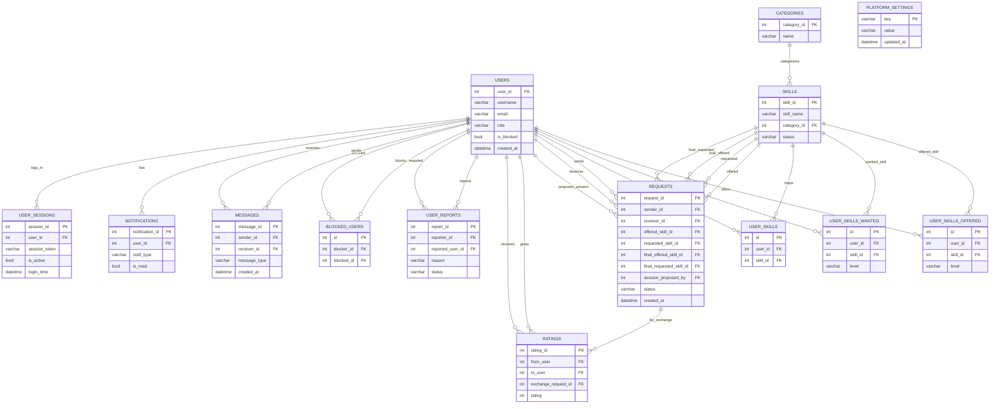

# SkillSwap ER Diagram

```mermaid
erDiagram
    USERS {
        int user_id PK
        varchar username
        varchar email
        varchar role
        bool is_blocked
        datetime created_at
    }

    CATEGORIES {
        int category_id PK
        varchar name
    }

    SKILLS {
        int skill_id PK
        varchar skill_name
        int category_id FK
        varchar status
    }

    USER_SKILLS_OFFERED {
        int id PK
        int user_id FK
        int skill_id FK
        varchar level
    }

    USER_SKILLS_WANTED {
        int id PK
        int user_id FK
        int skill_id FK
        varchar level
    }

    USER_SKILLS {
        int id PK
        int user_id FK
        int skill_id FK
    }

    REQUESTS {
        int request_id PK
        int sender_id FK
        int receiver_id FK
        int offered_skill_id FK
        int requested_skill_id FK
        int final_offered_skill_id FK
        int final_requested_skill_id FK
        int session_proposed_by FK
        varchar status
        datetime created_at
    }

    RATINGS {
        int rating_id PK
        int from_user FK
        int to_user FK
        int exchange_request_id FK
        int rating
    }

    USER_REPORTS {
        int report_id PK
        int reporter_id FK
        int reported_user_id FK
        varchar reason
        varchar status
    }

    BLOCKED_USERS {
        int id PK
        int blocker_id FK
        int blocked_id FK
    }

    MESSAGES {
        int message_id PK
        int sender_id FK
        int receiver_id FK
        varchar message_type
        datetime created_at
    }

    NOTIFICATIONS {
        int notification_id PK
        int user_id FK
        varchar notif_type
        bool is_read
    }

    USER_SESSIONS {
        int session_id PK
        int user_id FK
        varchar session_token
        bool is_active
        datetime login_time
    }

    PLATFORM_SETTINGS {
        varchar key PK
        varchar value
        datetime updated_at
    }

    CATEGORIES ||--o{ SKILLS : categorizes

    USERS ||--o{ USER_SKILLS_OFFERED : offers
    SKILLS ||--o{ USER_SKILLS_OFFERED : offered_skill

    USERS ||--o{ USER_SKILLS_WANTED : wants
    SKILLS ||--o{ USER_SKILLS_WANTED : wanted_skill

    USERS ||--o{ USER_SKILLS : maps
    SKILLS ||--o{ USER_SKILLS : maps

    USERS ||--o{ REQUESTS : sends
    USERS ||--o{ REQUESTS : receives
    SKILLS ||--o{ REQUESTS : offered
    SKILLS ||--o{ REQUESTS : requested
    SKILLS ||--o{ REQUESTS : final_offered
    SKILLS ||--o{ REQUESTS : final_requested
    USERS ||--o{ REQUESTS : proposes_session

    USERS ||--o{ RATINGS : gives
    USERS ||--o{ RATINGS : receives
    REQUESTS ||--o{ RATINGS : for_exchange

    USERS ||--o{ USER_REPORTS : reports
    USERS ||--o{ USER_REPORTS : reported

    USERS ||--o{ BLOCKED_USERS : blocks
    USERS ||--o{ BLOCKED_USERS : blocked

    USERS ||--o{ MESSAGES : sends
    USERS ||--o{ MESSAGES : receives

    USERS ||--o{ NOTIFICATIONS : has

    USERS ||--o{ USER_SESSIONS : logs_in
```

Generated from current SQL schema and Flask models.
